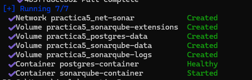
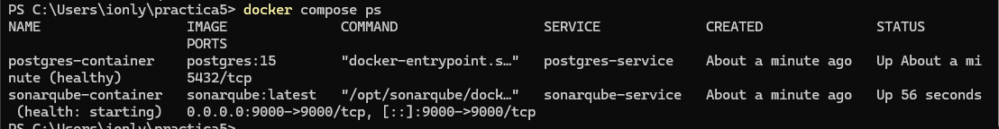
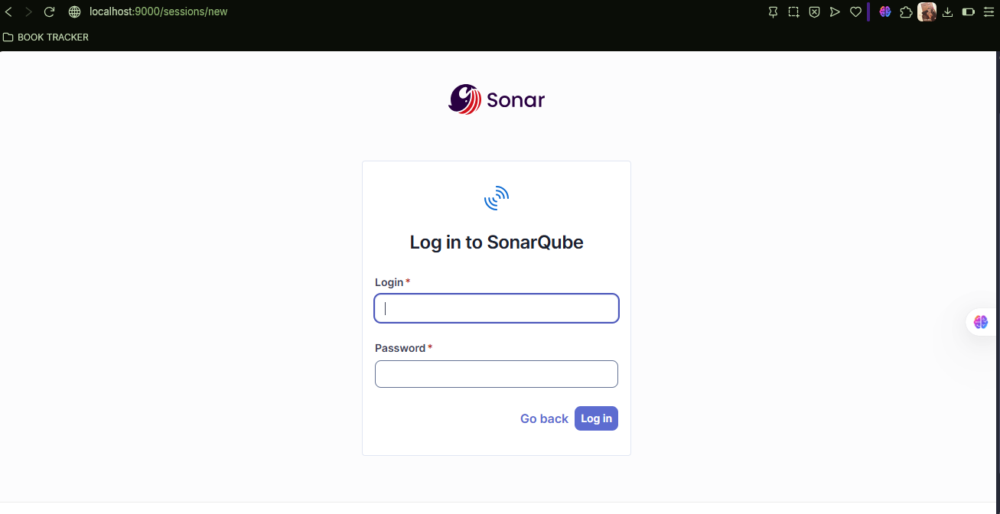
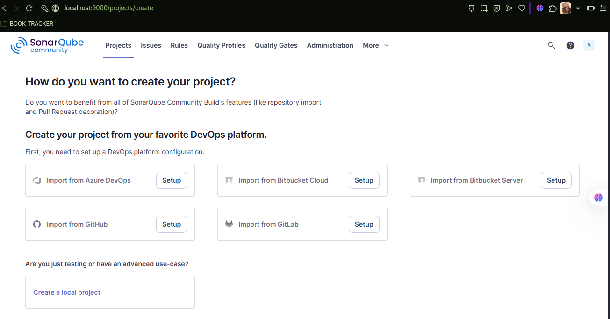

# Ejercicio
Configurar SonarQube utilizando Docker Compose, para esto necesitas dos servicios:
- Servicio: SonarQube
- Desde el host es necesario acceder a SonarQube por lo que necesitas mapear el puerto correspondiente.
- Servicio: PostgreSQL (existen otras opciones: Microsoft SQL Server, Oracle)
- Coloca un healtcheck para cada uno de los servicios.
- Los dos servicios deben pertenecer a una red de tipo bridge
- Investiga cuáles son los volúmenes necesarios para cada servicio

Volumenes necesarios: 
En caso de la base de datos PostgreSQL (postgres-data) y de SonarQube (data, logs, extensions).

- Investiga cuáles son las variables de entorno para que los servicios funcionen de manera adecuada.

En PostgreSQL, se deben configurar `POSTGRES_USER`, `POSTGRES_PASSWORD`, y `POSTGRES_DB` (nombre de la base de datos que usará SonarQube). 

En SonarQube necesita las variables `SONAR_JDBC_URL` (Este es menos intuitivo por el nombre, se refiere a la dirección JDBC que indica el host, puerto y nombre de la base de datos.), `SONAR_JDBC_USERNAME` y `SONAR_JDBC_PASSWORD`. 

  
# Una vez creado tu archivo .yaml realiza la respectiva prueba 

# COMPLETAR CON UNA CAPTURA DE PANTALLA LUEGO DE EJECUTAR EL ARCHIVO

# ACCEDER A LOCALHOST:puertoDefinido para ingresar a SonarQube

